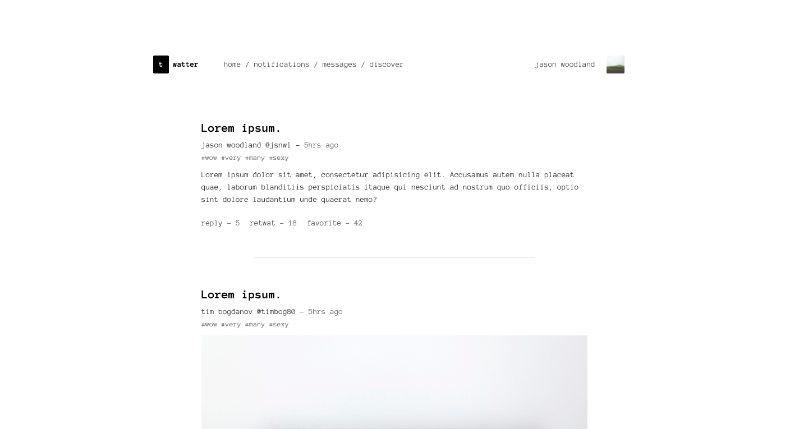
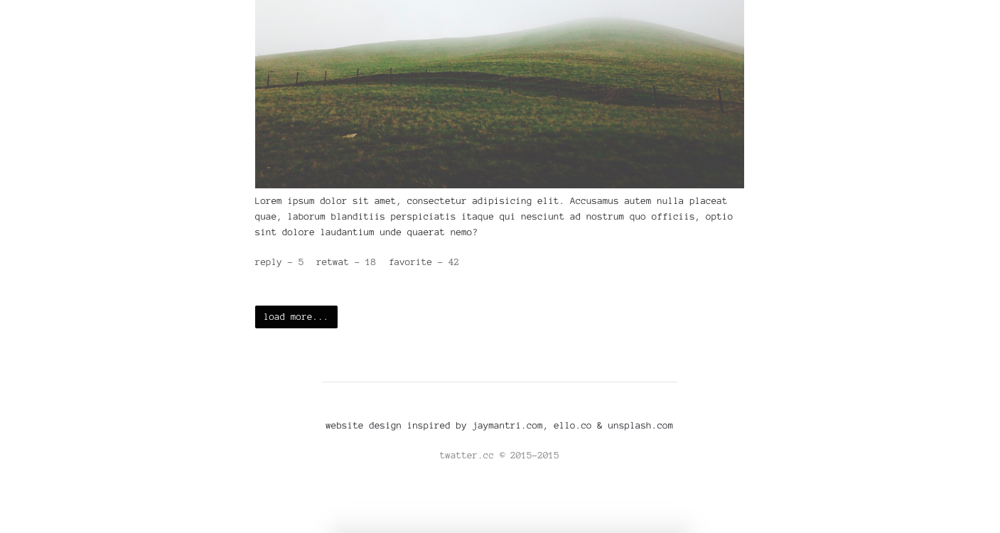

# dayOne: Twatter
A ten day challenge that I've challenged myself to do. dayTwo is a simple twitter monospace concept website. Ofcourse a very basic and simple concept.

# Sources used
Devtips Starter Kit:
[Get on GitHub](https://github.com/DevTips/DevTips-Starter-Kit)

Bourbon.io:
[Visit officail site](http://bourbon.io/)

